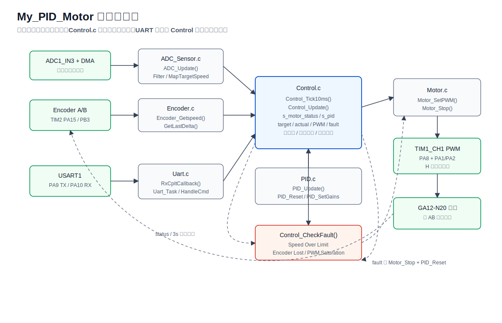
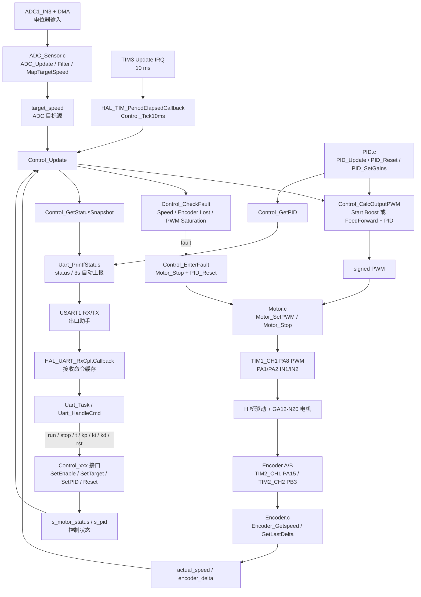
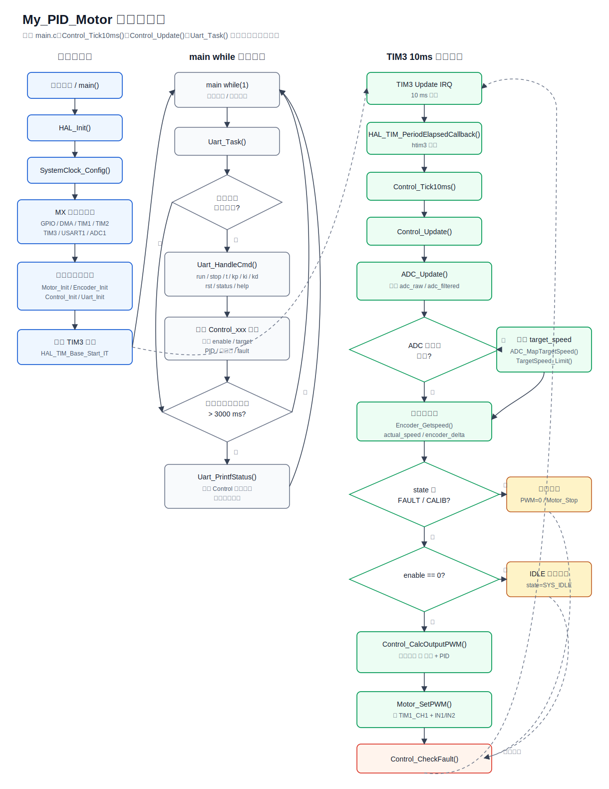
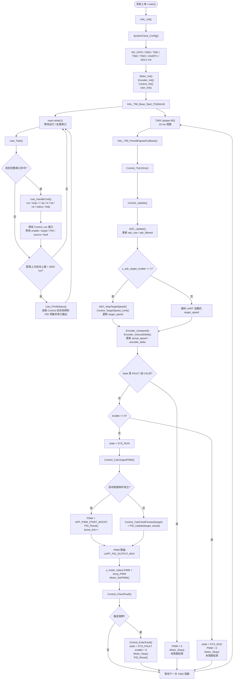

# My_PID_Motor

基于 STM32CubeIDE + STM32 HAL 的编码器闭环直流电机控制项目。项目围绕一台带 AB 相编码器的直流减速电机，完成 PWM 驱动、编码器测速、PID 闭环控制、ADC 目标速度输入、USART 串口调参、故障保护和调试记录整理。

本项目主要用于学习和展示嵌入式闭环控制系统的完整工程结构：从底层外设初始化，到电机驱动、速度反馈、控制算法、串口交互，再到调试记录和问题排查。

## 项目简介

控制目标是让电机实际速度 `actual_speed` 跟随目标速度 `target_speed`。目标速度可由 ADC 电位器输入，也可以通过串口命令设置。控制器周期性读取编码器速度，计算前馈 + PID 输出，最终通过 TIM1 PWM 和方向 GPIO 控制电机驱动模块。

当前工程已在 STM32F103C8Tx 平台上实现并调试：

```text
目标速度 target
    -> 前馈 PWM + PID 修正
    -> TIM1 PWM + IN1/IN2 方向控制
    -> 电机转动
    -> TIM2 编码器测速
    -> 实际速度 actual
    -> 回到控制器
```

## 功能列表

- TIM1_CH1 PWM 输出，支持有符号 PWM 指令控制电机正反转。
- TIM2 编码器接口读取 AB 相反馈，使用滑动窗口计算 RPM。
- TIM3 定时中断周期执行控制逻辑，当前控制周期为 10 ms。
- ADC1 + DMA 采集模拟量，并映射为目标速度。
- USART1 串口命令解析，支持运行控制、目标设置、PID 参数设置和状态查询。
- PID 算法模块独立封装，支持 `Kp/Ki/Kd` 设置、积分限幅、输出限幅和复位。
- 控制层维护系统状态、故障状态、目标来源、启动助推和状态快照。
- 故障保护包括超速、编码器丢失、PWM 长时间饱和。
- `docs/` 目录记录真实调试过程、PID 调参过程和典型问题排查。

## 硬件组成

| 模块 | 当前工程配置 | 说明 |
|---|---|---|
| MCU | STM32F103C8Tx | STM32CubeIDE + HAL 工程 |
| 电机 | GA12-N20 带编码器直流减速电机 | 实际调试使用的电机类型 |
| 电机驱动 | H 桥直流电机驱动模块 | 当前代码使用 PWM + IN1/IN2 控制方式，调试记录中以 TB6612 类模块为例 |
| PWM 输出 | PA8 / TIM1_CH1 | 输出占空比 |
| 方向控制 | PA1 / IN1, PA2 / IN2 | 控制正反转和停止 |
| 编码器 A 相 | PA15 / TIM2_CH1 | 已配置上拉 |
| 编码器 B 相 | PB3 / TIM2_CH2 | 已配置上拉 |
| 目标输入 | PA3 / ADC1_IN3 | ADC + DMA 采集电位器输入 |
| 串口 | PA9 / USART1_TX, PA10 / USART1_RX | 115200-8-N-1 |
| 控制定时器 | TIM3 Update IRQ | 10 ms 周期控制 |

调试经验：PA15/PB3 编码器输入需要稳定上拉，否则双相解码时可能出现异常计数、启动超速或反馈抖动。

## 软件架构

```text
Core/
  STM32CubeMX 生成的 HAL 初始化代码

App/Core/
  ADC_Sensor.c   ADC 采样、滤波、目标速度映射
  Encoder.c      TIM2 编码器读取、速度换算
  Motor.c        PWM 输出、方向 GPIO、停止电机
  Control.c      控制状态机、前馈+PID、故障保护
  Uart.c         串口接收、命令解析、状态打印

Lib/Core/
  PID.c          PID 算法实现

docs/
  调试记录.md
  PID调参记录.md
  问题排查记录.md
  串口命令说明.md
```

系统框图：



> 如果 Markdown 查看器不能渲染 Mermaid，可以直接打开 `docs/diagrams/system_architecture.svg` 查看图片。下面保留 Mermaid 源码，便于后续编辑。

<details>
<summary>系统框图 Mermaid 源码</summary>



</details>

说明：

- `Control_Update()` 是当前闭环控制的核心，由 `TIM3` 10 ms 定时中断触发。
- `ADC_Sensor.c` 负责 ADC 采样、滤波和 ADC 目标速度映射；只有 `s_adc_target_enable` 有效时，ADC 映射值才会写入 `target_speed`。
- `Uart.c` 负责串口命令接收、解析和状态输出，通过 `Control_SetEnable()`、`Control_SetTargetSpeed()`、`Control_SetKp/Ki/Kd()` 等接口修改控制层状态，不直接操作电机 PWM。
- `Encoder.c` 从 `TIM2` 编码器接口读取增量，并换算出 `actual_speed`，同时保存最近一次 `encoder_delta` 供控制和故障判断使用。
- `Control_CalcOutputPWM()` 根据启动助推、前馈和 PID 输出生成有符号 PWM，再交给 `Motor_SetPWM()`。
- `Motor.c` 负责把有符号 PWM 转换为 `TIM1_CH1` 比较值和 `IN1/IN2` 方向 GPIO。
- `Control_CheckFault()` 是 `Control.c` 内部的故障判断逻辑，不是独立文件；图中单独画出是为了说明超速、编码器丢失和 PWM 饱和保护的控制流。
- 当前工程没有独立日志模块，运行状态通过 `Uart_PrintfStatus()` 由串口输出，`docs/` 目录用于保存人工整理的调试记录。

模块分工：

- `Motor` 只负责把有符号 PWM 指令转换成方向 GPIO + TIM1 比较值。
- `Encoder` 只负责读取编码器计数并换算速度。
- `PID` 只负责控制算法计算和参数状态维护。
- `ADC_Sensor` 负责采样、滤波和 ADC 到目标速度的映射。
- `Control` 组合各底层能力，维护系统状态并输出本周期 PWM。
- `Uart` 负责命令入口和状态输出，不直接控制电机驱动、编码器、ADC 等控制对象。

## 工程目录说明

| 路径 | 说明 |
|---|---|
| `My_PID_Motor.ioc` | STM32CubeMX 外设配置文件 |
| `Core/Inc`, `Core/Src` | CubeMX 生成的 HAL 初始化、主函数和中断文件 |
| `Drivers/` | STM32 HAL 与 CMSIS 库 |
| `App/Inc`, `App/Core` | 应用层模块 |
| `Lib/Inc`, `Lib/Core` | 通用 PID 模块 |
| `docs/` | 调试记录、调参记录和问题排查 |
| `STM32F103C8TX_FLASH.ld` | 链接脚本 |
| `Debug/` | CubeIDE 生成的构建输出目录 |

## 控制流程简介

初始化流程：

```text
main()
  -> HAL_Init()
  -> SystemClock_Config()
  -> MX_GPIO_Init()
  -> MX_DMA_Init()
  -> MX_TIM1_Init()
  -> MX_TIM2_Init()
  -> MX_TIM3_Init()
  -> MX_USART1_UART_Init()
  -> MX_ADC1_Init()
  -> Motor_Init()
  -> Encoder_Init()
  -> Control_Init()
  -> Uart_Init()
  -> HAL_TIM_Base_Start_IT(&htim3)
```

周期控制流程：

```text
TIM3 中断
  -> HAL_TIM_PeriodElapsedCallback()
  -> Control_Tick10ms()
  -> Control_Update()
      -> ADC_Update()
      -> 更新 target_speed
      -> Encoder_Getspeed()
      -> 更新 actual_speed / encoder_delta
      -> 判断 FAULT / CALIB / enable
      -> Control_CalcOutputPWM()
          -> 启动助推 或 PWM_ff + PID
          -> PWM 限幅
      -> Motor_SetPWM()
      -> Control_CheckFault()
```

串口任务流程：

```text
USART1 RX 中断
  -> 每次接收 1 字节
  -> 收到 '\r' 或 '\n' 后置位命令就绪标志

main while
  -> Uart_Task()
  -> Uart_HandleCmd()
  -> 调用 Control 层接口
```

控制逻辑流程图：



> 如果 Markdown 查看器不能渲染 Mermaid，可以直接打开 `docs/diagrams/control_flow.svg` 查看图片。下面保留 Mermaid 源码，便于后续编辑。

<details>
<summary>控制流程图 Mermaid 源码</summary>



</details>

这张图和理想控制流程有几个关键区别：

- `ADC_Update()` 和 `Encoder_Getspeed()` 每个 `Control_Update()` 周期都会先执行，即使当前 `enable == 0` 或系统处于 `FAULT/CALIB`，也会先更新 ADC 和编码器状态，然后才判断是否停机返回。
- `PID_Update()` 不是每个 10 ms 周期都一定执行。只有系统不是 `FAULT/CALIB`、`enable != 0`，并且没有处于启动助推分支时，才会执行 `Control_CalcFeedForward() + PID_Update()`。
- `Control_CheckFault()` 在 `Motor_SetPWM()` 之后执行，所以本周期先输出 PWM，再检查是否触发超速、编码器丢失或 PWM 饱和故障；一旦触发故障，`Control_EnterFault()` 会停机并复位 PID。
- 串口状态输出不属于 `Control_Update()` 内部流程。`Uart_PrintfStatus()` 在 `main while` 中每 3 秒自动调用一次，也可以由 `status` 命令立即触发。

当前控制策略包含三部分：

- 启动助推：刚启动且编码器还没有增量时，短时间给较大的 `APP_PWM_START_BOOST`，用于打破静摩擦。
- 前馈输出：`PWM_ff = sign(target) * (kS + kV * abs(target))`，用于提供稳定运行所需的大致 PWM。
- PID 修正：根据 `target_speed - actual_speed` 修正前馈误差。

## 串口命令说明

串口参数：`115200-8-N-1`。命令需要以 `\r` 或 `\n` 结束，串口助手建议开启 CRLF。ADC 目标源当前映射为 `0` 到 `APP_TARGET_SPEED_MAX`；UART 目标源通过 `t=<num>` 支持正负速度。

| 命令 | 说明 | 成功响应 |
|---|---|---|
| `run=1` | 启动控制 | `OK:RUN` |
| `stop` | 停止电机 | `OK:STOP` |
| `run=0` | 停止电机，与 `stop` 等效 | `OK:STOP` |
| `t=<num>` | 设置 UART 目标速度，并切换到 UART 目标源 | `OK:TARGET` |
| `set target adc` | 使用 ADC 作为目标速度来源 | `OK:TARGET_ADC` |
| `set target uart` | 使用 UART 设置的目标速度 | `OK:TARGET_UART` |
| `kp=<num>` | 设置比例系数 | `OK:KP` |
| `ki=<num>` | 设置积分系数 | `OK:KI` |
| `kd=<num>` | 设置微分系数 | `OK:KD` |
| `rst` | 清 PID、清故障并回到 IDLE | `OK:RESET` |
| `status` | 立即打印状态 | 状态行 |
| `help` | 打印命令帮助 | 命令列表 |

典型状态输出：

```text
ms:118909,enable:0,State:IDLE,source:ADC,target:550,actual:0,delta:0,PWM:0,adc:2255,fault:NONE,kp:0.000,ki:0.000,kd:0.000
```

字段说明：

| 字段 | 含义 |
|---|---|
| `ms` | `HAL_GetTick()` 时间戳 |
| `enable` | 用户运行意图，1 表示允许运行 |
| `State` | `IDLE` / `RUN` / `FAULT` / `CALIB` |
| `source` | 目标速度来源，`ADC` 或 `Uart` |
| `target` | 目标速度 |
| `actual` | 编码器计算得到的实际速度 |
| `delta` | 当前控制周期编码器增量 |
| `PWM` | 本周期输出给电机的有符号 PWM |
| `adc` | ADC 原始值 |
| `fault` | 当前故障码 |
| `kp/ki/kd` | 当前 PID 参数 |

## PID 调参说明

建议调参顺序：

```text
1. 先确认 PWM、方向、编码器反馈方向正确。
2. 使用 UART 固定目标速度，避免 ADC 目标波动影响判断。
3. 初期设置 ki=0、kd=0，只调 kp。
4. 当前项目已引入前馈和启动助推后，kp 不应再承担全部启动力。
5. 前馈和启动助推稳定后，再少量增加 ki 消除长期误差。
6. kd 对低分辨率编码器测速噪声敏感，建议最后再评估。
```

当前项目中有几个重要调试结论：

- `PWM_ff = sign(target) * (kS + kV * abs(target))` 是稳定运行前馈，不负责保证从静止启动。
- 从静止启动需要单独的启动助推，不能只靠增大 `kp` 解决。
- 低分辨率编码器在短窗口下速度会跳变，调参时要结合 `delta` 判断。
- 若 `PWM > 0` 但 `actual < 0`，优先检查编码器 A/B 相方向。
- 若 `PWM` 很大但 `actual/delta` 仍为 0，优先检查编码器反馈链路。

详细调参过程见：

- `docs/PID调参记录.md`
- `docs/调试记录.md`
- `docs/问题排查记录.md`

## 故障处理机制

控制层维护 `SystemState_t` 和 `FaultCode_t`：

```c
SYS_IDLE
SYS_RUN
SYS_FAULT
SYS_CALIB
```

当前故障码：

```c
FAULT_NONE
FAULT_SPEED_OVER_LIMIT
FAULT_ENCODER_LOST
FAULT_PWM_SATURATION
```

故障触发逻辑：

| 故障 | 触发条件概述 | 处理动作 |
|---|---|---|
| `FAULT_SPEED_OVER_LIMIT` | 实际速度绝对值超过 `APP_SPEED_ABS_LIMIT` | 进入 FAULT，停止电机 |
| `FAULT_ENCODER_LOST` | 目标和 PWM 较大，但实际速度长期接近 0 | 进入 FAULT，停止电机 |
| `FAULT_PWM_SATURATION` | PWM 长时间接近饱和阈值 | 进入 FAULT，停止电机 |

进入故障后会：

- 设置 `state = SYS_FAULT`
- 设置 `enable = 0`
- 设置 `PWM = 0`
- 调用 `Motor_Stop()`
- 调用 `PID_Reset()`

串口非法命令只返回 `ERR:INVALID_CMD`，不进入系统故障。

## 如何编译运行

1. 使用 STM32CubeIDE 打开工程目录：

   ```text
   F:\hal_stm32_project\My_PID_Motor
   ```

2. 确认工程使用的 `.ioc` 文件为：

   ```text
   My_PID_Motor.ioc
   ```

3. 确认硬件连接：

   - PA8 -> 电机驱动 PWM
   - PA1/PA2 -> 电机驱动方向输入
   - PA15/PB3 -> 编码器 AB 相输入，并保持上拉
   - PA3 -> ADC 目标输入
   - PA9/PA10 -> USART1 串口
   - STM32、电机驱动和外部电源共地

4. 在 STM32CubeIDE 中执行 Build。

5. 使用 ST-Link 下载到 STM32F103C8Tx。

6. 打开串口助手：

   ```text
   Baudrate: 115200
   Data: 8
   Stop: 1
   Parity: None
   Line ending: CRLF
   ```

7. 发送命令：

   ```text
   help
   status
   set target uart
   t=500
   kp=0.100
   ki=0.000
   kd=0.000
   run=1
   stop
   ```

## 后续升级路线

### v1：巩固当前闭环控制工程

- 整理 `APP_TARGET_SPEED_MIN` 语义，区分速度绝对值下限和死区。
- 继续修正方向切换、目标变更时 PID reset 和启动助推逻辑。
- 将前馈、启动助推、PID 修正的参数标定流程写入文档。
- 增加串口命令对前馈参数 `kS/kV` 和启动助推参数的在线设置。
- 增加更完整的状态打印字段，例如前馈 PWM、PID 输出和启动助推状态。
- 保持 `docs/` 中的调试记录与代码同步。

### v2：提升控制性能和工程完整度

- 增加速度斜坡，避免目标速度突变导致输出冲击。
- 设计双向速度控制策略，完善正反转切换过程。
- 改进测速算法，例如更稳定的速度滤波或更长测速窗口。
- 将故障事件和触发瞬间数据保存为诊断快照。
- 增加参数持久化，将 PID 和前馈参数保存到 Flash。
- 增加上位机可视化调参工具或简单通信协议。
- 若迁移到 RTOS，可将控制、串口、状态上报拆分为独立任务。

## 项目特点

- 从真实调试问题出发，不只停留在 Demo 层面。
- 模块边界清晰，底层驱动、控制策略、串口交互分离。
- 保留了编码器接线、上拉、低分辨率测速、静摩擦启动等实际工程问题记录。
- 适合作为 STM32 HAL、定时器、编码器、ADC、UART 和 PID 控制的综合练习项目。
