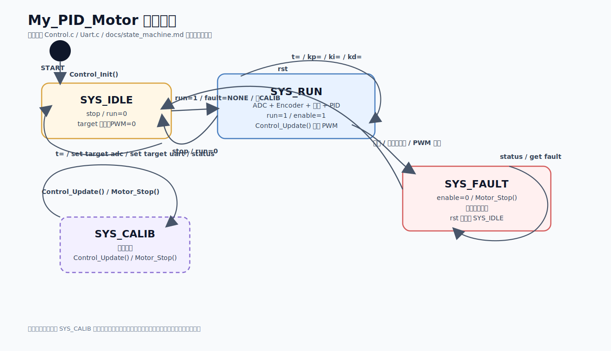
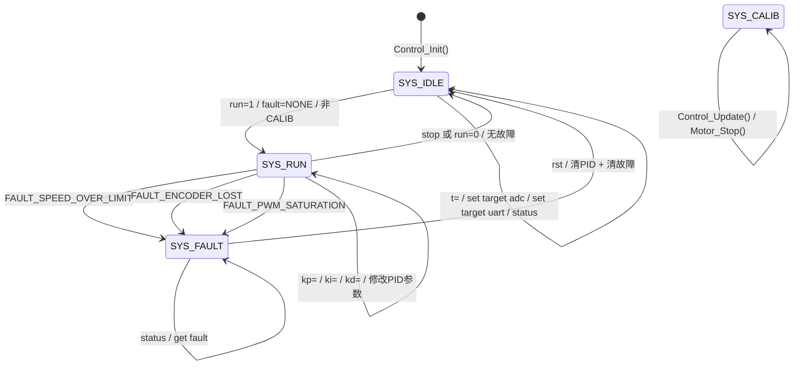

# My_PID_Motor 状态机图

## 1. 状态机概述

本项目是基于 STM32CubeIDE + STM32 HAL 的编码器直流电机闭环控制项目。控制层通过 `SystemState_t` 维护系统状态，通过 `FaultCode_t` 维护故障状态，并结合串口命令、ADC 目标输入、编码器反馈、PID 控制和故障保护逻辑，实现电机从空闲、运行、故障锁定到复位的状态变化。

当前源码中已经存在明确的状态枚举，因此本文优先使用源码中的真实状态名称：`SYS_IDLE`、`SYS_RUN`、`SYS_FAULT`、`SYS_CALIB`。

## 2. 状态定义表

| 状态          | 含义                                              | 代码依据                                                                                                        |
| ----------- | ----------------------------------------------- | ----------------------------------------------------------------------------------------------------------- |
| `SYS_IDLE`  | 空闲/停止状态，电机停止，`enable = 0`，PWM 输出为 0             | `Control_Init()` 默认设置 `s_motor_status.state = SYS_IDLE`；`Control_Update()` 中当 `enable == 0` 时设置为 `SYS_IDLE` |
| `SYS_RUN`   | 闭环运行状态，周期读取 ADC/编码器，计算前馈 + PID 输出，并驱动电机         | `Control_SetEnable(1)` 在无故障且非校准状态时设置 `SYS_RUN`；`Control_Update()` 中当 `enable != 0` 时设置 `SYS_RUN` 并执行 PWM 计算 |
| `SYS_FAULT` | 故障锁定状态，电机停止，`enable = 0`，需要复位后才能恢复运行            | `Control_EnterFault()` 设置 `state = SYS_FAULT`、`enable = 0`，并调用 `Motor_Stop()`                               |
| `SYS_CALIB` | 校准/预留状态，当前代码中 `Control_Update()` 检测到该状态后停止电机并返回 | `SystemState_t` 中定义了 `SYS_CALIB`；`Control_Update()` 中对 `SYS_CALIB` 有停机处理，但当前公开源码中未看到明确进入/退出该状态的串口命令路径       |

## 3. 状态转换条件表

| 当前状态        | 触发条件                                                   | 下一状态                         | 代码依据                                                                                                               |
| ----------- | ------------------------------------------------------ | ---------------------------- | ------------------------------------------------------------------------------------------------------------------ |
| 上电/初始化      | 调用 `Control_Init()`                                    | `SYS_IDLE`                   | 初始化时设置 `fault = FAULT_NONE`、`enable = 0`、`state = SYS_IDLE`                                                        |
| `SYS_IDLE`  | 收到 `run=1`，且当前 `fault == FAULT_NONE`，并且不处于 `SYS_CALIB` | `SYS_RUN`                    | `Uart_HandleCmd()` 解析 `run=1` 后调用 `Control_SetEnable(1)`；`Control_SetEnable()` 内部设置 `state = SYS_RUN`、`enable = 1` |
| `SYS_RUN`   | 收到 `stop` 或 `run=0`                                    | `SYS_IDLE`                   | `Uart_HandleCmd()` 解析 `stop/run=0` 后调用 `Control_SetEnable(0)`；如果当前无故障，则设置 `state = SYS_IDLE`                       |
| `SYS_RUN`   | 实际速度超过限制                                               | `SYS_FAULT`                  | `Control_CheckFault()` 检测到 `abs(actual_speed) > APP_SPEED_ABS_LIMIT` 后进入 `FAULT_SPEED_OVER_LIMIT`                  |
| `SYS_RUN`   | 目标速度和 PWM 较大，但编码器反馈长期接近 0                              | `SYS_FAULT`                  | `Control_CheckFault()` 中编码器丢失计数达到阈值后进入 `FAULT_ENCODER_LOST`                                                        |
| `SYS_RUN`   | PWM 长时间接近饱和阈值                                          | `SYS_FAULT`                  | `Control_CheckFault()` 中 PWM 饱和计数达到阈值后进入 `FAULT_PWM_SATURATION`                                                    |
| `SYS_FAULT` | 周期控制继续执行                                               | `SYS_FAULT`                  | `Control_Update()` 检测到 `state == SYS_FAULT` 时调用 `Motor_Stop()` 并直接返回                                               |
| `SYS_FAULT` | 收到 `rst`，执行 PID 复位和故障复位                                | `SYS_IDLE`                   | `Uart_HandleCmd()` 中 `rst` 调用 `Control_PID_Rst()` 和 `Control_ResetFault()`；需要以本地源码中 `Control_ResetFault()` 的实际实现为准 |
| `SYS_CALIB` | 周期控制继续执行                                               | `SYS_CALIB`                  | `Control_Update()` 检测到 `state == SYS_CALIB` 时设置 `PWM = 0`，调用 `Motor_Stop()` 并返回                                    |
| 任意非故障状态     | 收到 `t=数值`                                              | 状态不一定变化，只改变目标速度并切换到 UART 目标源 | `Uart_HandleCmd()` 中 `t=` 调用 `Control_SetTargetSpeed()`；该命令主要改变 `target_speed` 和目标源，不直接启动电机                        |
| 任意状态        | 收到 `status`                                            | 状态不变化                        | `status` 只调用 `Uart_PrintfStatus()` 输出状态                                                                            |
| 任意状态        | 收到 `get fault`                                         | 状态不变化                        | `get fault` 只调用 `Uart_HandleFaultSnapShot()` 查询故障快照                                                                |

## 4. Mermaid 状态机图

> 如果 Markdown 查看器不能渲染 Mermaid，可以直接打开 `docs/diagrams/state_machine.svg` 查看图片。下面保留 Mermaid 源码，便于后续编辑。

说明：`SYS_CALIB` 是源码中已经定义的状态，并且 `Control_Update()` 中有对应停机处理；但当前公开源码中没有看到清晰的串口命令或控制接口把系统切入 `SYS_CALIB`，因此图中只保留其自保持停机行为，不把它与其他状态强行连接。

## 5. 状态机运行说明

系统上电后，`Control_Init()` 初始化 PID、ADC、控制状态和故障计数，并将系统状态设为 `SYS_IDLE`。此时 `enable = 0`，目标速度、实际速度、PWM 输出均初始化为 0，故障码为 `FAULT_NONE`。

串口收到 `run=1` 后，`Uart_HandleCmd()` 调用 `Control_SetEnable(1)`。如果当前没有故障，并且系统不处于 `SYS_CALIB`，控制层会将 `state` 设置为 `SYS_RUN`，同时设置 `enable = 1`，并复位 PID。进入 `SYS_RUN` 后，周期控制任务会读取 ADC、编码器速度，计算前馈 + PID 输出，并调用电机驱动模块输出有符号 PWM。

串口收到 `stop` 或 `run=0` 后，`Uart_HandleCmd()` 调用 `Control_SetEnable(0)`。控制层会清除运行使能、PWM 输出和启动助推状态，并复位 PID。如果当前没有故障，状态回到 `SYS_IDLE`；如果当前仍有故障，则保持或进入 `SYS_FAULT`。

串口收到 `t=数值` 后，系统会调用 `Control_SetTargetSpeed()` 设置目标速度，并切换到 UART 目标源。这个命令本身不等于启动电机。如果当前处于 `SYS_IDLE`，设置目标速度后仍然不会运行，只有再发送 `run=1` 才会进入运行状态。

串口收到 `set target adc` 后，系统切换为 ADC 目标源；收到 `set target uart` 后，系统切换为 UART 目标源。目标源切换影响 `target_speed` 的来源，但不直接改变 `SYS_IDLE / SYS_RUN / SYS_FAULT` 的状态。

在 `SYS_RUN` 中，`Control_CheckFault()` 会检测超速、编码器丢失和 PWM 饱和等异常。一旦触发故障，系统调用 `Control_EnterFault()`，保存故障快照，设置故障码，将状态切换为 `SYS_FAULT`，同时设置 `enable = 0` 并停止电机。

故障快照不是一个独立状态，而是进入 `SYS_FAULT` 时保存的一组诊断信息。当前快照结构中包含 `valid`、`tick_ms`、`fault`、`state`、`target_speed`、`actual_speed`、`pwm`、`adc_target`、`adc_aux` 等字段。串口命令 `get fault` 只用于查询故障快照，不会改变系统状态。

当前公开源码中，TIM3 定时回调 `HAL_TIM_PeriodElapsedCallback()` 对 `flag_control_tick` 进行累加，说明 TIM3 负责产生控制节拍；具体 `Control_Tick10ms()` 的执行位置应以 `main.c` 中主循环调度为准。如果本地代码已经改成“TIM3 中断只置位 flag，主循环执行控制任务”，则状态机逻辑仍然不变，只是控制任务执行位置从中断内转移到了主循环中。

## 6. 当前状态机的限制

1. 当前状态数量较少，主要围绕 `SYS_IDLE`、`SYS_RUN`、`SYS_FAULT` 展开，`SYS_CALIB` 虽然已定义，但当前公开源码中未看到明确进入/退出路径。
2. 故障类型目前集中在超速、编码器丢失和 PWM 饱和，尚未扩展到过流、欠压、温度异常、传感器异常等更完整的工业故障类型。
3. `get fault` 只用于读取故障快照，不应被理解为状态转换。
4. 第二路 ADC 已有采集字段，但当前主要用于状态记录和快照扩展，尚未参与状态转换或故障判断。
5. 当前日志主要通过串口状态输出实现，日志本身不参与控制闭环。
6. 当前状态机没有区分 `READY`、`STARTING`、`STOPPING`、`DONE` 等更细的过程状态。
7. 如果公开仓库与本地最新代码不同，应以本地可编译版本为准重新核对状态转换。

## 7. 源码与 README / 串口命令说明不一致项

根据当前公开仓库内容，存在以下需要后续核对的点：

1. README 中仍描述 “TIM3 定时中断周期执行控制逻辑 / Control_Tick10ms”，但当前公开 `Control.c` 中 TIM3 回调表现为只累加 `flag_control_tick`。如果本地已经改成主循环调度控制任务，建议同步更新 README 和控制流程图。
2. README 的典型状态输出中字段示例为 `adc`，而当前 `Uart_PrintfStatus()` 中输出字段包含 `adc1` 和 `adc2`。建议后续统一文档字段。
3. README 中串口命令表未明确列出 `get fault`，但 `Uart_PrintHelp()` 和命令解析中已经支持 `get fault`。建议后续将该命令补入 README 的串口命令说明。
4. `Control.h` 声明了 `Control_ResetFault()`，`Uart.c` 中 `rst` 命令也调用了它；如果公开 `Control.c` 中未包含该函数实现，应核对本地代码是否已经实现并提交。

## 8. v1 后续建议

以下内容是后续升级建议，不属于当前真实状态机，不应混入当前 Mermaid 图中。

| 建议状态                | 建议用途                                |
| ------------------- | ----------------------------------- |
| `SYS_READY`         | 区分“已准备好但未运行”和单纯 `IDLE`              |
| `SYS_STARTING`      | 表示启动助推阶段，便于分析静摩擦启动过程                |
| `SYS_STOPPING`      | 表示停止过渡阶段，便于处理软停机或速度斜坡               |
| `SYS_FAULT_LATCHED` | 表示故障锁存，要求用户明确复位后才允许重新运行             |
| `SYS_PARAM_UPDATE`  | 如果以后支持在线修改前馈、PID、启动助推参数，可短暂进入参数更新状态 |
| `SYS_CALIB` 完善路径    | 当前已有枚举，可后续补充进入/退出命令和校准流程            |

v1 阶段建议保持当前真实状态机简单清晰，不要急着增加过多状态。优先把 `SYS_IDLE / SYS_RUN / SYS_FAULT` 的状态转换、串口命令、故障快照和文档说明完全对齐。
